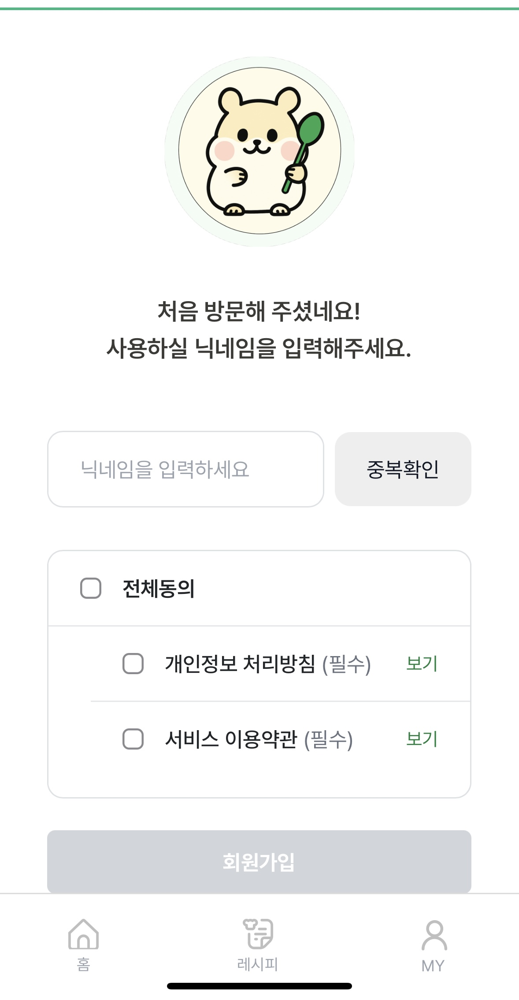
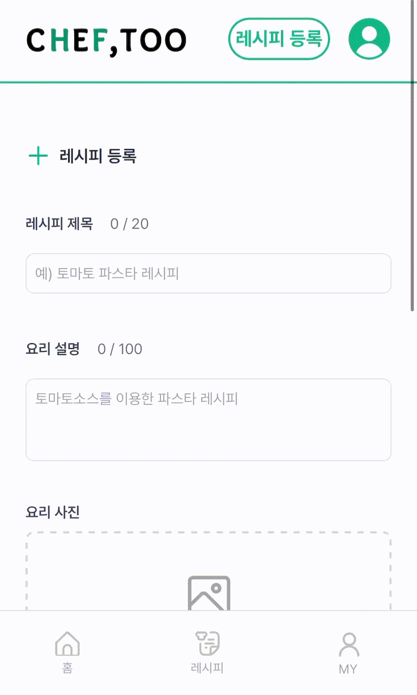
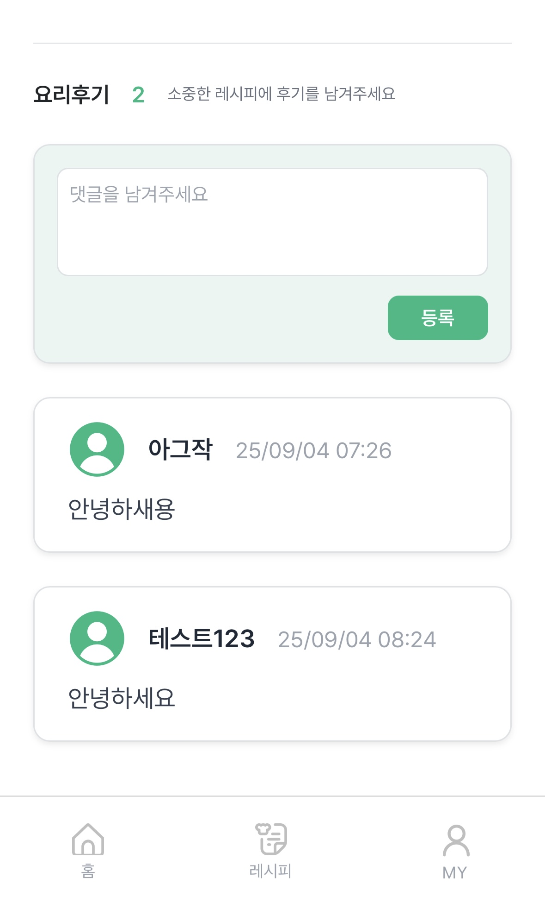
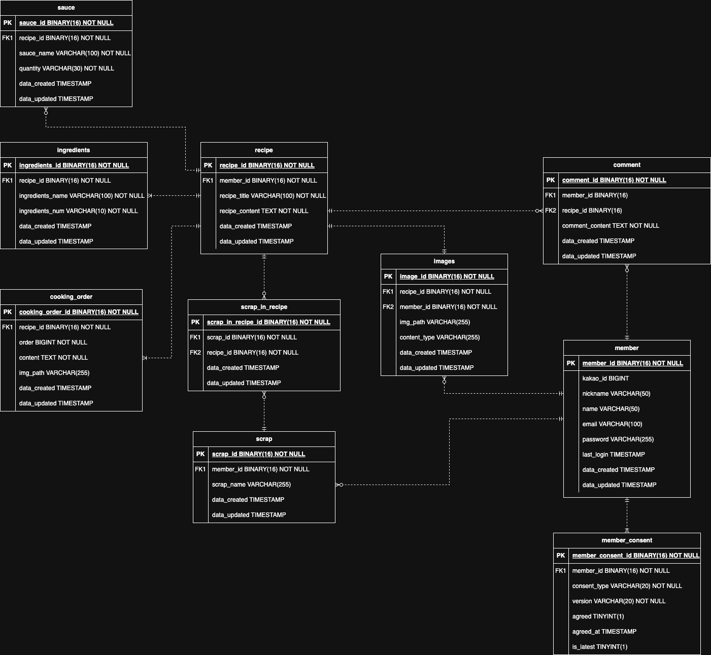
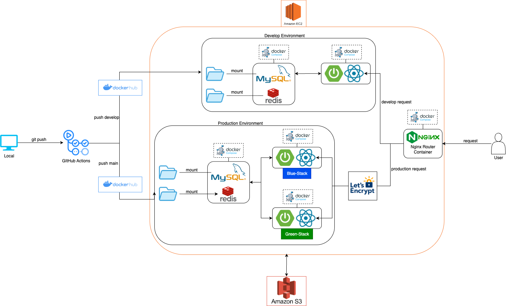

# 🍳 Cheftoo(나도 요리사) - 레시피 공유 서비스

---

## 🌼 프로젝트 소개

---
🏷️ 프로젝트 명 : Chef too (나도 요리사)  
👥 프로젝트 구성원 : 2명 ( Backend 1명, Frontend 1명)  
📖 담당 역할 : 백엔드 개발 / 인프라 구축 / 전체 설계


## 🌱 서비스 소개

---
- 요리 레시피를 업로드하고, 스크랩/댓글로 소통할 수 있는 플랫폼
- YouTube 요리 영상 추천, 이미지 업로드 등 기능 포함
- 서비스 링크 바로가기 👉 https://cheftoo.co.kr


## 💻 기술 스택

---

### Language
`Java 21`  

### Framework
`Spring Boot 3.3.4`, `Spring Security`, `JPA`, `QueryDSL`

### Database
`MySQL`, `Redis`

### Infra & DevOps
`Docker`, `Docker Compose`, `Nginx`, `GitHub Actions (CI/CD)`, `Blue-Green 무중단 배포 전략`, `AWS EC2`, `AWS S3`, `Route53`


### Frontend
`React`, `Axios`, `Nginx 정적 파일 호스팅`


## 🍎 기능 소개

---

### ✅ 카카오 로그인 및 이용약관 동의
> 처음 접속하는 사용자는 닉네임 중복확인 및 약관동의 후, 회원가입을 진행합니다.
<p align="center">
  
</p>  

<br>

### ✅ 레시피 등록
> 레시피 이미지, 레시피 제목, 레시피 설명, 재료, 양념, 조리순서를 등록합니다.
<p align="center">
  
</p>

<br>

### ✅ 레시피 조회 & 검색
> 전체 레시피 조회 및 검색키워드를 포함한 레시피를 검색합니다.
<p align="center">
  
</p>
<br>


### ✅ 인기 레시피 조회 & 요리 관련 유튜브 영상 조회
> 홈 화면에서 인기 레시피 조회와 요리 관련한 유튜브 영상을 확인할 수 있습니다.
<p align="center">
  
</p>
<br>

### ✅ 레시피 댓글
> 다른 유저의 댓글 조회와 동시에 레시피에 댓글을 달 수 있고, 작성한 댓글을 삭제할 수 있습니다. 
<p align="center">
  
</p>
<br>

### ✅ 레시피 스크랩
> 마음에 드는 레시피를 나만의 폴더에 스크랩 할 수 있습니다.
<p align="center">
  
</p>
<br>


### ✅ 마이페이지
> 로그아웃, 회원탈퇴 등 회원상태 관련 작업을 할 수 있습니다.   
> 스크랩한 레시피, 업로드한 레시피, 작성한 댓글을 조회 및 삭제할 수 있습니다.
<p align="center">
  
</p>
<br>


## 🔎 ERD (Entity Relationship Diagram)

---



> 주요 테이블: `Member`, `Recipe`, `Ingredient`, `CookingOrder`, `Images`, `Scrap`, `Comment`

<br>

## ⚙️ 아키텍처

---




### 1. 환경 구성 
- EC2 단일 서버에 `개발/운영` 환경을 모두 구성하였습니다.
- `Docker Compose`를 사용해 MySQL, Redis, Spring Boot, React, Nginx 컨테이너를 손쉽게 관리하도록 설계하였습니다.
- 운영 환경은 `Blue-Green` 배포 전략을 적용하여 무중단 배포가 가능하도록 설계하였습니다.


### 2. CI/CD 파이프라인
- develop, main 브랜치로 구분하여 `GitHub Actions`를 통해 각각 개발/운영용 Docker 이미지로 빌드 및 `Docker Hub`에 푸시하고 있습니다.
- 운영 배포 시, `Blue/Green` 반대 스택에 자동으로 배포하고 있습니다.
- 서버에서는 최신 이미지를 pull 후, 해당 Compose 스택을 재시작하여 배포하고 있습니다.
- `.env` 파일과 GitHub Secrets를 통해 환경 변수 관리를 하고 있습니다.

### 3. 데이터 관리
- MySQL과 Redis는 `Docker Volume` 혹은 `EC2 로컬 디렉토리`에 마운트하여, 컨테이너 재배포 시에도 데이터가 유지되도록 구성하였습니다.

### 4. 요청 흐름
- 모든 요청은 `Nginx Reverse Proxy` 컨테이너를 통해 라우팅되고 있습니다.
- /api 요청은 Spring Boot 컨테이너로, 그 외 요청은 React 정적 자원으로 전달됩니다.
- 운영 환경은 `HTTPS`를 적용하기 위해 `Let's Encrypt` 인증서를 사용하였습니다.

<br>


## 🗂️ 폴더 구조

---
```
cheftoo  
┣ 📂gradle  
┣ 📂out  
┣ 📂src  
┃ ┣ 📂main  
┃ ┃ ┣ 📂java  
┃ ┃ ┃ ┣ 📂jwhs  
┃ ┃ ┃ ┃ ┣ 📂cheftoo  
┃ ┃ ┃ ┃ ┃ ┣ 📂auth  
┃ ┃ ┃ ┃ ┃ ┃ ┣ 📂controller  
┃ ┃ ┃ ┃ ┃ ┃ ┣ 📂dto  
┃ ┃ ┃ ┃ ┃ ┃ ┣ 📂entity  
┃ ┃ ┃ ┃ ┃ ┃ ┣ 📂enums  
┃ ┃ ┃ ┃ ┃ ┃ ┣ 📂exception  
┃ ┃ ┃ ┃ ┃ ┃ ┣ 📂port  
┃ ┃ ┃ ┃ ┃ ┃ ┣ 📂repository  
┃ ┃ ┃ ┃ ┃ ┃ ┗ 📂service  
┃ ┃ ┃ ┃ ┃ ┣ 📂comment  
┃ ┃ ┃ ┃ ┃ ┃ ┣ 📂controller  
┃ ┃ ┃ ┃ ┃ ┃ ┣ 📂dto  
┃ ┃ ┃ ┃ ┃ ┃ ┣ 📂entity  
┃ ┃ ┃ ┃ ┃ ┃ ┣ 📂exception  
┃ ┃ ┃ ┃ ┃ ┃ ┣ 📂repository  
┃ ┃ ┃ ┃ ┃ ┃ ┗ 📂service  
┃ ┃ ┃ ┃ ┃ ┣ 📂config  
┃ ┃ ┃ ┃ ┃ ┣ 📂cookingorder  
┃ ┃ ┃ ┃ ┃ ┃ ┣ 📂dto  
┃ ┃ ┃ ┃ ┃ ┃ ┣ 📂entity  
┃ ┃ ┃ ┃ ┃ ┃ ┣ 📂repository  
┃ ┃ ┃ ┃ ┃ ┃ ┗ 📂service  
┃ ┃ ┃ ┃ ┃ ┣ 📂global  
┃ ┃ ┃ ┃ ┃ ┣ 📂image  
┃ ┃ ┃ ┃ ┃ ┃ ┣ 📂controller  
┃ ┃ ┃ ┃ ┃ ┃ ┣ 📂dto  
┃ ┃ ┃ ┃ ┃ ┃ ┣ 📂entity  
┃ ┃ ┃ ┃ ┃ ┃ ┣ 📂enums  
┃ ┃ ┃ ┃ ┃ ┃ ┣ 📂exception  
┃ ┃ ┃ ┃ ┃ ┃ ┣ 📂repository  
┃ ┃ ┃ ┃ ┃ ┃ ┗ 📂service  
┃ ┃ ┃ ┃ ┃ ┣ 📂ingredient  
┃ ┃ ┃ ┃ ┃ ┃ ┣ 📂dto  
┃ ┃ ┃ ┃ ┃ ┃ ┣ 📂entity  
┃ ┃ ┃ ┃ ┃ ┃ ┣ 📂repository  
┃ ┃ ┃ ┃ ┃ ┃ ┣ 📂service  
┃ ┃ ┃ ┃ ┃ ┣ 📂recipe  
┃ ┃ ┃ ┃ ┃ ┃ ┣ 📂controller  
┃ ┃ ┃ ┃ ┃ ┃ ┣ 📂dto  
┃ ┃ ┃ ┃ ┃ ┃ ┣ 📂entity  
┃ ┃ ┃ ┃ ┃ ┃ ┣ 📂exception  
┃ ┃ ┃ ┃ ┃ ┃ ┣ 📂repository  
┃ ┃ ┃ ┃ ┃ ┃ ┗ 📂service  
┃ ┃ ┃ ┃ ┃ ┣ 📂sauce  
┃ ┃ ┃ ┃ ┃ ┃ ┣ 📂dto  
┃ ┃ ┃ ┃ ┃ ┃ ┣ 📂entity  
┃ ┃ ┃ ┃ ┃ ┃ ┣ 📂repository  
┃ ┃ ┃ ┃ ┃ ┃ ┗ 📂service  
┃ ┃ ┃ ┃ ┃ ┣ 📂scrap  
┃ ┃ ┃ ┃ ┃ ┃ ┣ 📂controller  
┃ ┃ ┃ ┃ ┃ ┃ ┣ 📂dto  
┃ ┃ ┃ ┃ ┃ ┃ ┣ 📂entity  
┃ ┃ ┃ ┃ ┃ ┃ ┣ 📂exception  
┃ ┃ ┃ ┃ ┃ ┃ ┣ 📂repository  
┃ ┃ ┃ ┃ ┃ ┃ ┗ 📂service  
┃ ┃ ┃ ┃ ┃ ┣ 📂security  
┃ ┃ ┃ ┃ ┃ ┣ 📂util  
┃ ┃ ┃ ┃ ┃ ┃ ┣ 📂port  
┃ ┃ ┃ ┃ ┃ ┣ 📂youtube  
┃ ┃ ┃ ┃ ┃ ┃ ┣ 📂controller  
┃ ┃ ┃ ┃ ┃ ┃ ┣ 📂dto  
┃ ┃ ┃ ┃ ┃ ┃ ┣ 📂enums  
┃ ┃ ┃ ┃ ┃ ┃ ┣ 📂scheduler  
┃ ┃ ┃ ┃ ┃ ┃ ┗ 📂service  
┃ ┃ ┣ 📂resources  
┃ ┃ ┃ ┣ 📂static  
┃ ┃ ┃ ┣ 📂templates  
```

<br>

##  📝 API 명세서

---
| Domain | Method | Endpoint             | 설명                            |
|--------|--------|----------------------|-------------------------------|
| 인증/인가  | GET    | /api/oauth/kakao/callback      | Kakao Redirect UrI            |
| 인증/인가  | GET    | /api/auth/check        | Bearer Token 유효 검증            |
| 인증/인가  | POST   | /api/auth/refresh | Token 재발급                     |
| 인증/인가  | POST   | /api/auth/logout     | 로그아웃                          |
| 인증/인가  | POST   | /api/member/terms/agree | 동의항목 저장 및 회원가입 처리             |
| 레시피    | POST   | /api/recipe | 레시피 등록                        |
| 레시피    | PUT    | /api/recipe/{recipeId} | 레시피 수정                        |
| 레시피    | GET    | /api/recipe/{recipeId} | 특정 레시피 조회                     |
| 레시피    | GET    | /api/recipe | 레시피 목록 조회(필터링&페이징 지원)         |
| 레시피    | DELETE | /api/recipe/{recipeId} | 레시피 삭제                        |
| 레시피    | GET    | /api/recipe/member | 특정 멤버 레시피 리스트 조회              |
| 레시피    | GET    |/api/recipe/popular-top10 | 인기순 레시피 조회( 10개 )             |
| 댓글     | GET    |/api/recipe/comment/{recipeId} | 특정 레시피 모든 댓글 조회               |
| 댓글     | POST    |/api/recipe/{recipeId}/comment | 댓글 생성                         |
| 댓글     | DELETE    |/api/recipe/comment/{commentId} | 댓글 삭제                         |
| 댓글     | GET    |/api/member/comment | 특정 멤버의 댓글 전부 조회               |
| 스크랩    | GET    |/api/member/scrap | 특정 유저 스크랩 모두 조회               |
| 스크랩     | POST    |/api/member/scrap | 스크랩 저장                        |
| 스크랩     | PUT    |/api/member/scrap/{scrapId} | 스크랩 폴더 이름 수정                  |
| 스크랩     | DELETE    |/api/member/scrap/{scrapId} | 스크랩 삭제                        |
| 스크랩     | POST    |/api/member/scrap/{scrapId}/recipe/{recipeId} | 특정 스크랩에 레시피 저장                |
| 스크랩     | GET    |/api/member/scrap/{scrapId}/recipe | 특정 스크랩의 레시피리스트 조회             |
| 스크랩     | DELETE    |/api/member/scrap/recipe | 특정 스크렙의 특정 레시피 삭제             |
| 이미지     | GET    |/api/images/recipe-image/presigned-put | 레시피 이미지 저장하는 presignedURL 조회  |
| 이미지     | GET    |/api/images/cooking-order-image/presigned-put | 조리순서 이미지 저장하는 presignedURL 조회 |
| 유튜브     | GET    |/api/images/cooking-order-image/presigned-put | 유튜브 videoId 조회                |
| 유튜브     | GET    |/api/images/cooking-order-image/presigned-put | 유튜브 비디오리스트 version 조회         |
| 멤버     | GET    |/api/member/nickname/check | 멤버 닉네임 중복검사                   |
| 멤버     | GET    |/api/member/me | 현재 로그인한 유저의 member ID 조회      |
| 멤버     | DELETE    |/api/member/me | 회원 탈퇴         |
| 멤버     | PUT    |/api/member/nickname | 닉네임 설정         |
| 멤버     | GET    |/api/member/nickname | 닉네임 조회         |


<br>


# 👥 팀원 소개

| 이름  | 역할                 | 담당 업무                                                               | 깃허브 주소 |
|-----|--------------------|---------------------------------------------------------------------|--------|
| 김지우 | 백엔드 개발 / 인프라 구축 / 전체 설계 | - API 설계 및 개발<br> - DB 모델링<br> - CI/CD 구축<br> - 서버 아키텍처 설계 및 인프라 구축 |https://github.com/jiubuntu|
| 김희수 | 프론트엔드 개발 / UI/UX설계 | - React 화면 및 기능 개발<br> - Figma 디자인 및 UI/UX 설계<br> - 사용자 기능 구현       |https://github.com/KimHeeH|